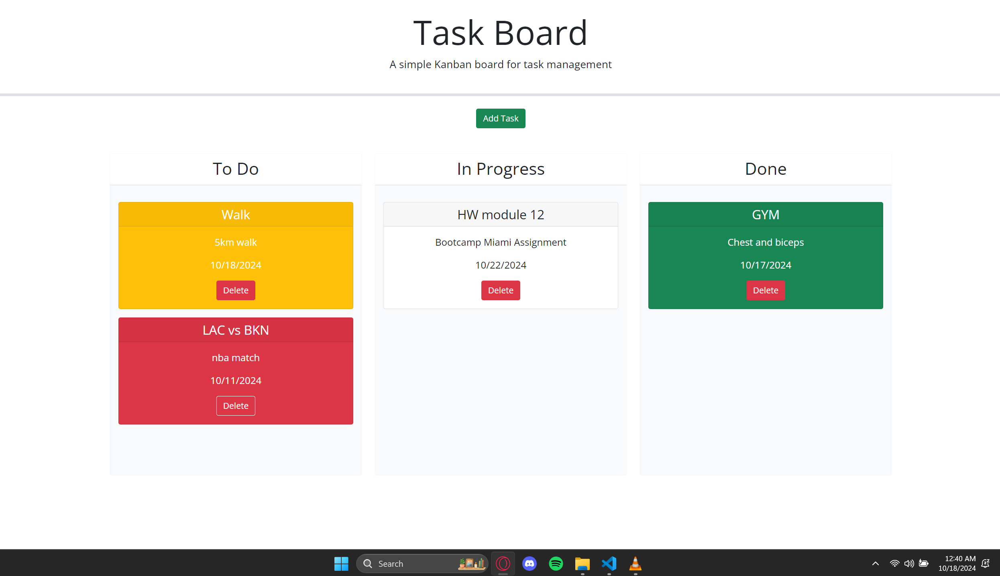

# Task Board - Management Tool

## Description

This project is a simple task board (Kanban-style) application that allows users to manage tasks visually by organizing them into different progress states. It features dynamically updated HTML and CSS powered by jQuery, making it easy to create, update, and delete tasks. Tasks can be dragged and dropped between columns representing their status (To Do, In Progress, and Done). The application also color-codes tasks based on their proximity to their due date, giving users a clear indication of task urgency.

The app persists task data in **localStorage**, ensuring that tasks remain after the page is refreshed. It utilizes the **Day.js** library to handle date manipulation, making it easier to track and display task deadlines.

## Features

- **Add Tasks**: Users can add tasks with a title, description, and due date through a modal form.
- **Task Progress**: Tasks are organized into "To Do", "In Progress", and "Done" columns, and users can drag and drop tasks between columns to update their status.
- **Task Persistence**: All tasks are saved in **localStorage**, so they persist even after refreshing the page.
- **Color Coding**: Tasks are color-coded based on their due date:
  - **Yellow**: Task is due today.
  - **Red**: Task is overdue.
- **Delete Tasks**: Users can delete tasks, and the changes are saved.

# Usage

1. **Add a Task**: 
   - Click the "Add Task" button to open the task creation modal.
   - Fill in the task details, including the title, description, and due date.
   - Click the "Add Task" button in the modal to add the task to the board.

2. **Move a Task**: 
   - Drag and drop tasks between the columns (To Do, In Progress, Done) to update their progress status.
   - When a task is moved to the "Done" column, its color will change to green to indicate completion.

3. **Delete a Task**: 
   - Click the "Delete" button on the task card to remove it from the board.

4. **View Task Urgency**: 
   - Tasks will automatically change color based on their due date:
     - Yellow indicates tasks due today.
     - Red indicates overdue tasks.
     - Green indicates tasks that are marked as done.

## Screenshot

**Repo:**

[Github Repo](https://github.com/briansotolago/Task-Board-Management-Tool)

**Link of the web Page:**

[Github Page](https://briansotolago.github.io/Task-Board-Management-Tool/)
